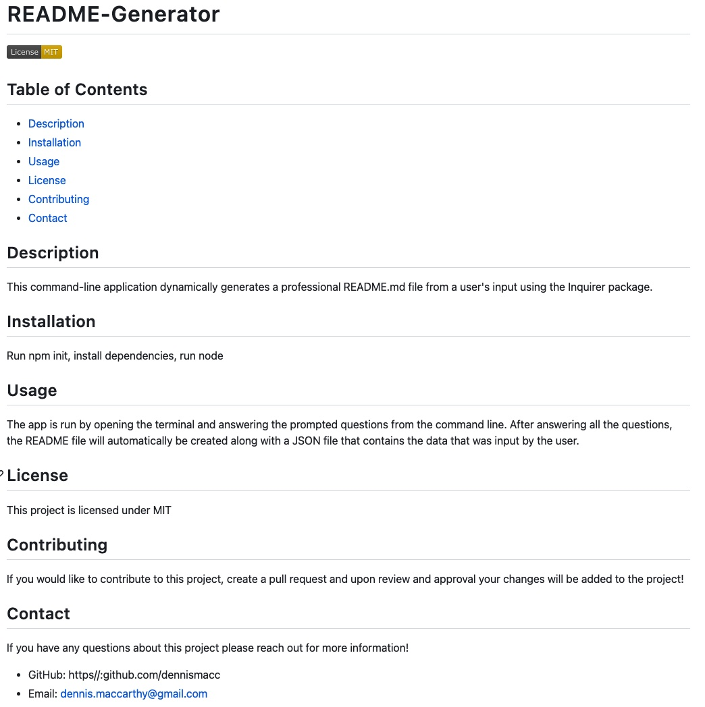

# README-Generator
This command-line application dynamically generates a professional README.md file from a user's input using the Inquirer package.

## Description

## Usage
This application can be used opening the command line and answering the prompted questions within the terminal. After you answer all of the questions in the command line then your README file will be automatically created along with a JSON file that has all the data that was inputed by the user.
The repository for this application can be viewed at https://github.com/dennismacc/README-Generator. 

